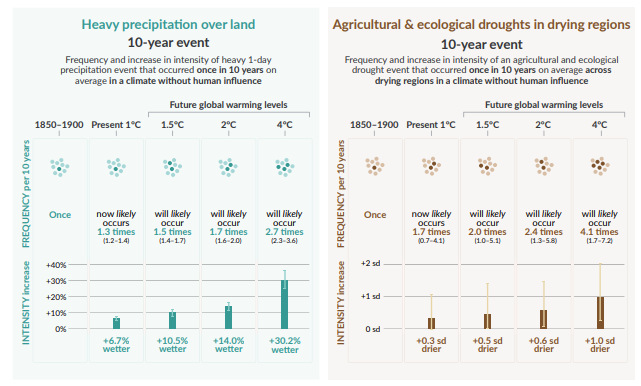
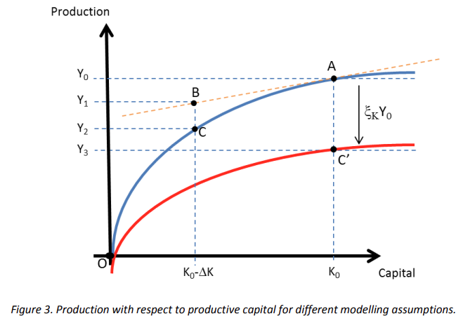

Capital damages are generally due to climate change induced extreme weather impacts, such as floods, droughts or wildfires that directly destruct capital assets. See **Fig1** on expected increased frequency of extreme events from the IPCC AR6 WGI report [IPCC (2021)](https://www.ipcc.ch/report/ar6/wg1/downloads/report/IPCC_AR6_WGI_SPM.pdf).

|                                                                                                             |
| ------------------------------------------------------------------------------------------------------------------------------------------------------ |
| **Fig1**<br>[Source: IPCC AR6 WGI SP, p18 (Masson-Delmotte _et al._, 2021)]( https://www.ipcc.ch/report/ar6/wg1/downloads/report/IPCC_AR6_WGI_SPM.pdf) |

## Types of capital stock
Damages are expected to destroy capital stock, but the *type* of capital stock destroyed can differ quite much and have an impact on how the actual damage impacts economy and people. We can differentiate based on the *owner* of the stock and the *type* *of the asset*, but there will be important overlaps. In general, these four categories give a good first step:

1. Private capital (business) - real estate and machinery used for production and services
2. Private capital (people) - mostly housing, also transport?
3. Public capital (infrastructure) - infrastructure, including roads, sewer systems, electricity grid(?), etc.
4. Natural capital - ???

Note, that the type of *owner* kind of corresponds to the *type of assets* too, however there can be substantial overlap between some: e.g., business private capital and resident's private capital both include buildings; while both natural and private business capital can include trees / forests.
## Capital stock damage implications
### Private capital (business)
Destruction of private *business* capital is the most straightforward (haha!) to capture in economic modelling. It can be treated as a supply constraint, with the ratio of assets destroyed inducing a given production constraint of the sectors' output. Nevertheless, while the effects here are more straightforward than in other cases the overall approach still needs a number of factors to be determined / specified.

#### **From asset losses to output loss**
First, we start here, when capital assets are destroyed we assume that leads to some kind of output loss. Basically, a [[Supply constraint]] that is driven by lack of ready machinery or access to buildings or destroyed buildings or cars... 

Now the crucial part here is how we go from losses (i.e., non-current capital asset losses due to damages) to actual supply constraint on production.

**Hallegatte (2014a):**
> *The first step in an assessment of output losses is to estimate how much output is lost because of these direct asset losses.* [...]

> **idealized case** *at the economic equilibrium and under certain conditions, the value of an asset is the net present value of its expected future production. In this case, the annual loss of output is equal to the value of the lost capital multiplied by the marginal productivity of capital (which is equal to the interest rate, increased by the depreciation rate)*

> *To account for the fact that disasters affect capital in a way that is different from optimal accumulation (or de-accumulation) of capital, Hallegatte et al. (2007) propose to modify the Cobb–Douglas production function by introducing a term ξK, which is the proportion of non-destroyed capital. This new variable ξK is such that the effective capital is K=ξK·K0, where K0 is the potential productive capital, in absence of disaster. In Figure 3, the new production level is given by the relationship: 

```math
Y_3 = ξ_K f(L,K_0) = A ξ_K L^λ K_0^μ
``` 
>  *With this new production function, an x% destruction of the productive capital reduces production by x%, and the loss in output is approximately equal to 1/μ times the loss of asset estimated using the normal production function, where is the parameter that describes decreasing returns in the production function. In Figure 3, the new production function is the red line and the new production Y3 is given by the point C’.


> *With these assumptions, the loss in output is not equal to the value of lost assets multiplied by the marginal productivity of capital anymore. Instead, output losses are equal to the value of lost assets multiplied by the average productivity of capital, which is $\frac{1}{\mu}$ times larger than the marginal capital productivity. With classical values for $\mu$, it means that output reduction at the time of shock ($t_0$) is about 3 times larger than what is suggested by the market value of damaged assets (i.e. what is estimated with Eq.(2)). As result, production losses are then given by:*

```math 
\Delta Y(t_0) = \frac{1}{\mu}r \Delta K
```

**Hallegatte (2008)** is an ARIO modeling exercise on the economic cost of the Katrina hurricane. The paper aims to take into account:
>  *(1) the taking into account of sector production capacities and of both forward and backward propagations within the economic system; and (2) the introduction of adaptive behaviors* [...]
>   *According to Rose et al., “for inclusion into an IO model, we must convert gross output changes into final demand changes because the latter are the conduits through which external shocks are transmitted.”* [...]
>   *(on CGE's marketing clearing) market-clearing hypothesis is **valid only over longer timescales than the few months we want to consider here**.*
>   *In case of bottleneck in the industry i, it is necessary to describe how its clients are rationed. In ARIO, the rationing scheme is a mix of priority system and proportional rationing. *We assume that if an industry cannot satisfy demand, intermediate consumptions needed by other industries are served in priority. It means that, in case of rationing, exports, final local demand, and reconstruction are the first demands not to be satisfied.** <mark>The priority given to intermediate consumption is justified by several facts. Exports are rationed first because consumers outside the affected region can easily find other producers. Final demand consists of household demand plus investments (except reconstruction). Investments can easily be delayed in case of disaster and can, therefore, be rationed with milder consequences. Household consumption is rationed before intermediate consumption because business-to-business relationships are most of the time deeper than business-to-household relationships and because a business would often favor business clients over household clients.</mark>   

Nevertheless, in the exercises Hallegatte (2008) takes a simplified asset loss to output loss relation, basically assuming that productive assets to output loss relation is 1:1. 

**Hallegatte et al. (2019)** says the following:
> *First, output losses after a disaster destroys part of the capital stock are better estimated by using the average—not the marginal—productivity of capital.* [...]

>[!CAUTION]
>This will be inevitably linked to the [Cambridge capital controversy](https://en.wikipedia.org/wiki/Cambridge_capital_controversy). I.e., whether capital is *simply* capital or there is no substitutability between different types and vignettes of capital. Hallegatte et al. (2019) cites Stiglitz (1974) on the topic - *plainly speaking* - Stiglitz basically discards the issue, saying that the issue of aggregates is likely minimal, but he does note that there **are** cases where this might **not** be the case. Hallegatte in the subsequent text states that **damages from natural disasters** are exactly a case like this. 

>[...] *the traditional production function implicitly assumes that the capital which has not been destroyed can immediately and freely be relocated to its most productive use* [...]
>[...] *assets such as roads or offices cannot be transformed into other assets such as bridges or factories at no cost and instantaneously* [...]

> *But we also need to take into account the **spill-over effects of asset losses: when assets are imperfectly substitutable, the loss of one asset affects the productivity of other assets**. Output losses are not only due to forgone production from the assets that have been destroyed or damaged by the event. Assets that have not been affected by the disaster can also become unable to produce at the pre-event level because of indirect impacts. For instance, most economic activity cannot take place during a power outage, because electricity is an essential (and often non-substitutable) input in the production process.* [...]

> [!NOTE]
> It needs to be taken account that in the context of MINDSET (and demand-led / non-equilibrium models) capital damages and resulting output losses decrease the **potential output** rather than the actual output. I.e., if there was an upward production gap before the event, the event might destroy capital that causes a loss of **potential production**, but at the same time previously unused production might take the place of the lost production.

#### **Temporal dynamics**

#### **Output losses to supply constraints** 
Expected output losses are need to be translated into supply constraints in the model. How supply constraints are treated then is described in [[Supply constraint]].
 
### Interaction between capital types

# **Literature**

Diem, C., Borsos, A., Reisch, T., Kertész, J. and Thurner, S. (2022), “Quantifying firm-level economic systemic risk from nation-wide supply networks”, _Scientific Reports_, Nature Publishing Group, Vol. 12 No. 1, p. 7719, doi: [10.1038/s41598-022-11522-z](https://doi.org/10.1038/s41598-022-11522-z).

Hallegatte, S. (2008), “An Adaptive Regional Input-Output Model and its Application to the Assessment of the Economic Cost of Katrina”, _Risk Analysis_, Vol. 28 No. 3, pp. 779–799, doi: [10.1111/j.1539-6924.2008.01046.x](https://doi.org/10.1111/j.1539-6924.2008.01046.x).

Hallegatte, S. (2012), “Modeling the Roles of Heterogeneity, Substitution, and Inventories in the Assessment of Natural Disaster Economic Costs”, _World Bank Policy Research Working Paper_, No. 6047. https://documents.worldbank.org/en/publication/documents-reports/documentdetail/410441468142479058/modeling-the-roles-of-heterogeneity-substitution-and-inventories-in-the-assessment-of-natural-disaster-economic-costs

Hallegatte, S. (2014a), “Economic Resilience: Definition and Measurement”, _World Bank Policy Research Working Paper_, No. 6852. https://documents.worldbank.org/en/publication/documents-reports/documentdetail/350411468149663792/economic-resilience-definition-and-measurement

Hallegatte, S. (2014b), “Modeling the Role of Inventories and Heterogeneity in the Assessment of the Economic Costs of Natural Disasters”, _Risk Analysis_, Vol. 34 No. 1, pp. 152–167, doi: [10.1111/risa.12090](https://doi.org/10.1111/risa.12090).

Hallegatte, S., Jooste, C. and McIsaac, F. (2024), “Modeling the macroeconomic consequences of natural disasters: Capital stock, recovery dynamics, and monetary policy”, _Economic Modelling_, Vol. 139, p. 106787, doi: [10.1016/j.econmod.2024.106787](https://doi.org/10.1016/j.econmod.2024.106787).

Hallegatte, S. and Vogt-Schilb, A. (2019), “Are Losses from Natural Disasters More Than Just Asset Losses?”, in Okuyama, Y. and Rose, A. (Eds.), _Advances in Spatial and Economic Modeling of Disaster Impacts_, Springer International Publishing, Cham, pp. 15–42, doi: [10.1007/978-3-030-16237-5_2](https://doi.org/10.1007/978-3-030-16237-5_2).

Henriet, F., Hallegatte, S. and Tabourier, L. (2012), “Firm-network characteristics and economic robustness to natural disasters”, _Journal of Economic Dynamics and Control_, Vol. 36 No. 1, pp. 150–167, doi: [10.1016/j.jedc.2011.10.001](https://doi.org/10.1016/j.jedc.2011.10.001).

Masson-Delmotte, V., Zhai, P., Pirani, S., Connors, C., Péan, S., Berger, N., Caud, Y., _et al._ (Eds.). (2021), _IPCC, 2021: Summary for Policymakers. in: Climate Change 2021: The Physical Science Basis. Contribution of Working Group i to the Sixth Assessment Report of the Intergovernmental Panel on Climate Change_, Cambridge University Press, Cambridge, United Kingdom and New York, NY, USA. https://www.ipcc.ch/report/ar6/wg1/downloads/report/IPCC_AR6_WGI_SPM.pdf

Pichler, A., Pangallo, M., del Rio-Chanona, R.M., Lafond, F. and Farmer, J.D. (2022), “Forecasting the propagation of pandemic shocks with a dynamic input-output model”, _Journal of Economic Dynamics and Control_, Vol. 144, p. 104527, doi: [10.1016/j.jedc.2022.104527](https://doi.org/10.1016/j.jedc.2022.104527).