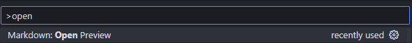
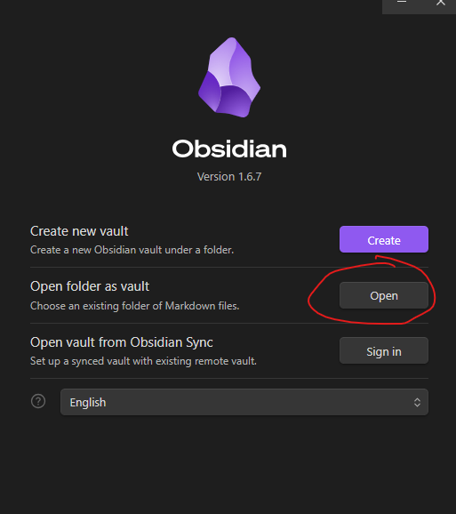
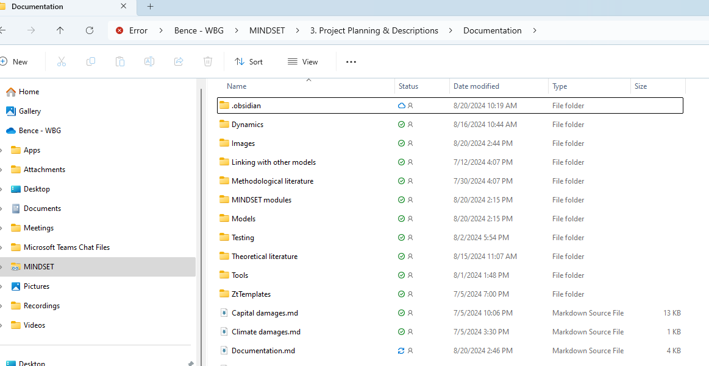
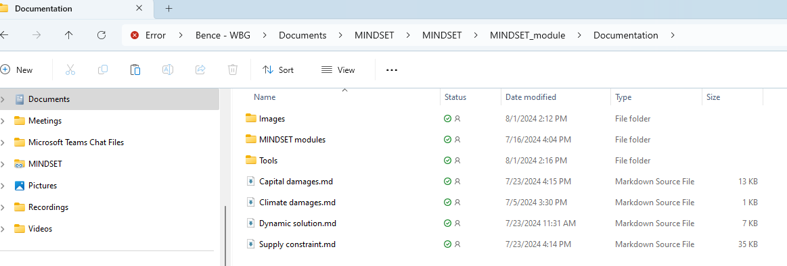
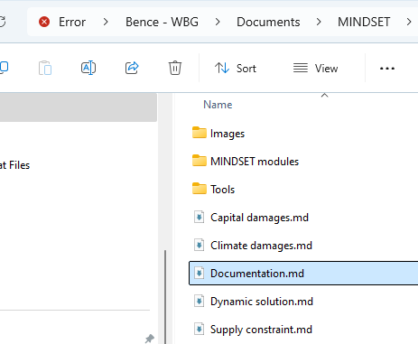
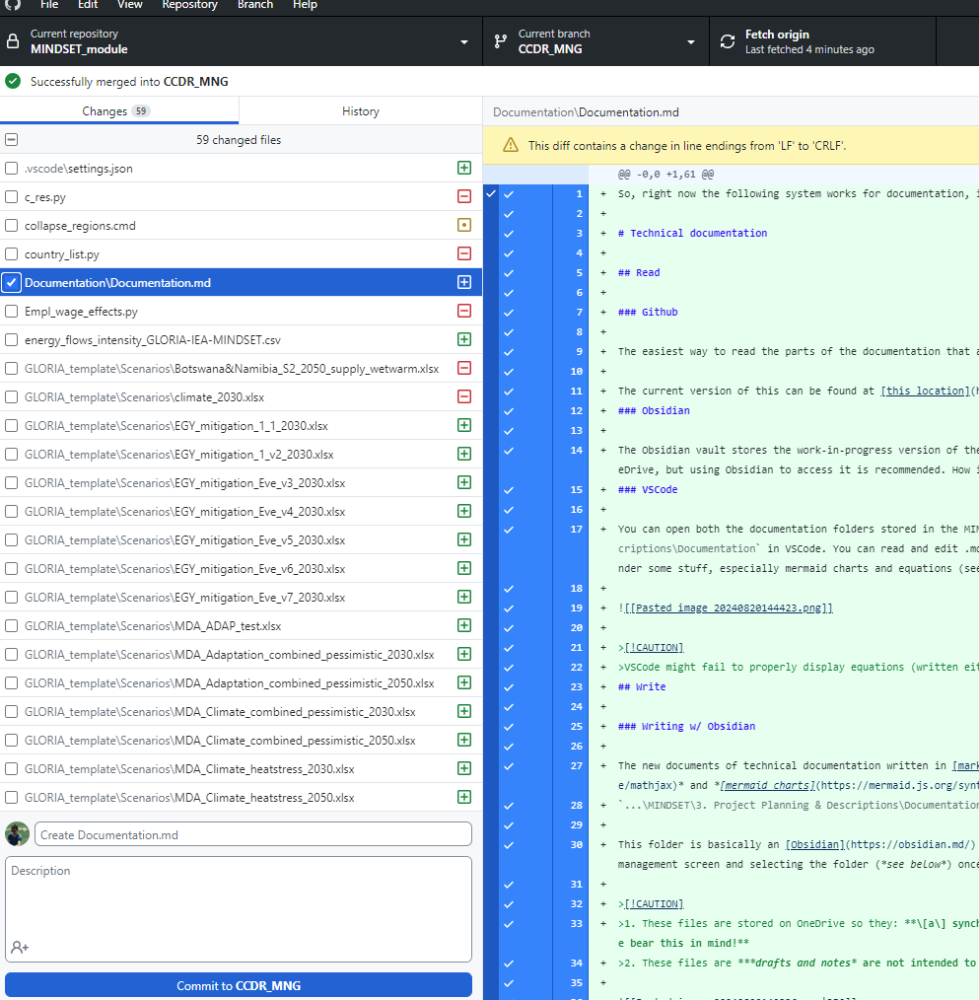
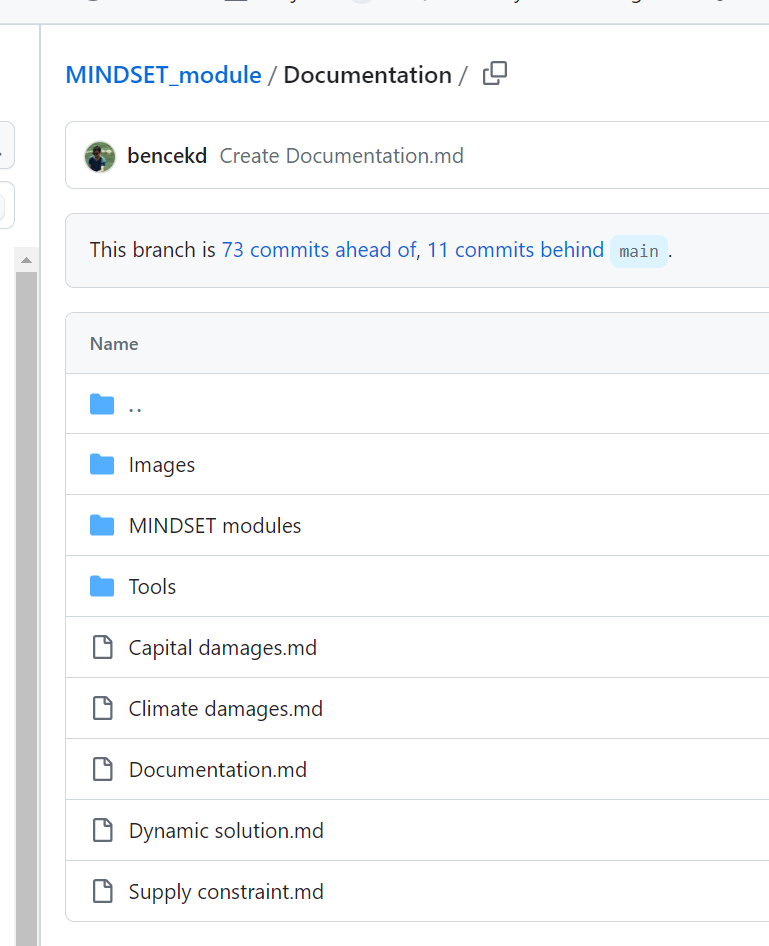
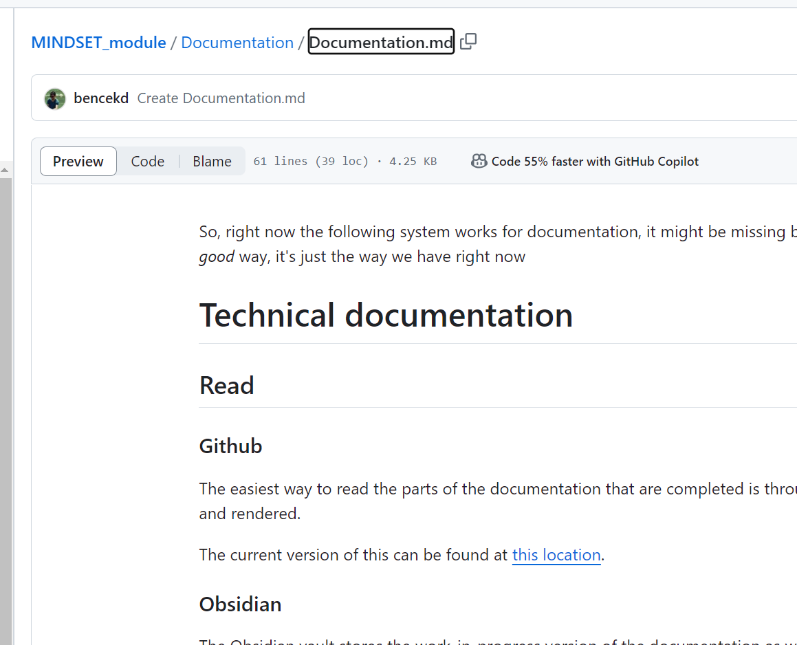

So, right now the following system works for documentation, it might be missing bits and it can definitely be made better; so don't take it as a *good* way, it's just the way we have right now

# Technical documentation

## Read

### Github

The easiest way to read the parts of the documentation that are completed is through Github, were the completed markdown files are stored and rendered. 

The current version of this can be found at [this location](https://github.com/cpmodel/MINDSET_module/tree/CCDR_MNG/Documentation).
### Obsidian

The Obsidian vault stores the work-in-progress version of the documentation as well as notes on various parts of the model and source materials for further development. It can be directly accessed through the OneDrive, but using Obsidian to access it is recommended. How it can be opened and seen as an Obsidian vault is described below -> [[#Writing w/ Obsidian]].
### VSCode 

You can open both the documentation folders stored in the MINDSET repository and the Obsidian vault files with VSCode. E.g., for the Obsidian vault, you simply need to open `...\MINDSET\3. Project Planning & Descriptions\Documentation` in VSCode. You can read and edit .md files from here and you can even preview rendered markdown files by selecting *'Markdown: Open Preview'* at the top. However, VSCode might fail to render some stuff, especially mermaid charts and equations (see the note below).



>[!CAUTION]
>VSCode might fail to properly display equations (written either in Obsidian or in Github flavour) and it won't display mermaid charts.
## Write

### Writing w/ Obsidian

The new documents of technical documentation written in [markdown](https://help.obsidian.md/Editing+and+formatting/Basic+formatting+syntax) and using both *[mathjax](https://bearnok.com/grva/en/knowledge/software/mathjax)* and *[mermaid charts](https://mermaid.js.org/syntax/flowchart.html)* is stored on the main OneDrive folder, located at:
`...\MINDSET\3. Project Planning & Descriptions\Documentation`

This folder is basically an [Obsidian](https://obsidian.md/) vault. Once you install Obsidian (*which you can probably do even without IT*) you can open it as such by clicking on **'Open'** in the Obsidian vault management screen and selecting the folder (*see below*) once you did this, you'll be able to edit the files directly.

>[!CAUTION]
>1. These files are stored on OneDrive so they: **\[a\] synchronise across, \[b\] do not have version control; this means that if you change something that will change the files for everyone who uses this! Please bear this in mind!** 
>2. These files are ***drafts and notes* are not intended to be shared with people outside of the group.** 



### Github

Completed notes / guides / etc. that are relevant for the model's functioning should be eventually moved to Github, for dissemination and for version control. In the Github repo we have a `Documentation` folder, which includes `MINDSET modules` and `Tools` folders. These replicate the same folders from the Obsidian vault.

The process for updating these is simple. Once a note is "completed" you can simply copy it from OneDrive to the location of your local MINDSET repository's `Documentation` folder. Then* commit it with Github.

>[!NOTE]
>There are some formatting changes that need to be done in order for Github to display equations as they should appear. 
>1. Beginning `$$` should be replaced with ` ```math` around equations, while ending `$$` should be replaced with ` ``` ` .
>2. `_` characters might need to be escaped, this can be done by putting a backslash in front of them. So, `A = \text{trade_share}` might become `A = \text{trade\_share}`.
>3. `\tag{x}` components are need to be removed from the end of equations.

Once you have committed check that Github renders the files as it should: https://github.com/cpmodel/MINDSET_module/tree/CCDR_MNG/Documentation

#### How to move stuff to Github

1. Open the vault's folder
   


2. Copy the file that you want to move, in this case `Documentation.md`
   
3. Go to your own MINDSET repository and copy the file to the relevant folder, in this case this will be the root of the `Documentation` folder
   

4. Paste the file here
   

5. Commit from Github
   

6. Push to Github
   


7. Check if renders correctly in remote (Github.com) repo, [here](https://github.com/cpmodel/MINDSET_module/blob/CCDR_MNG/Documentation/Documentation.md)
   


>[!WARNING]
>Don't forget that if you added pictures to your markdown file, you also going to need to upload those to Github! **Linking images also have a slightly different syntax on Github, pay attention to this!**

