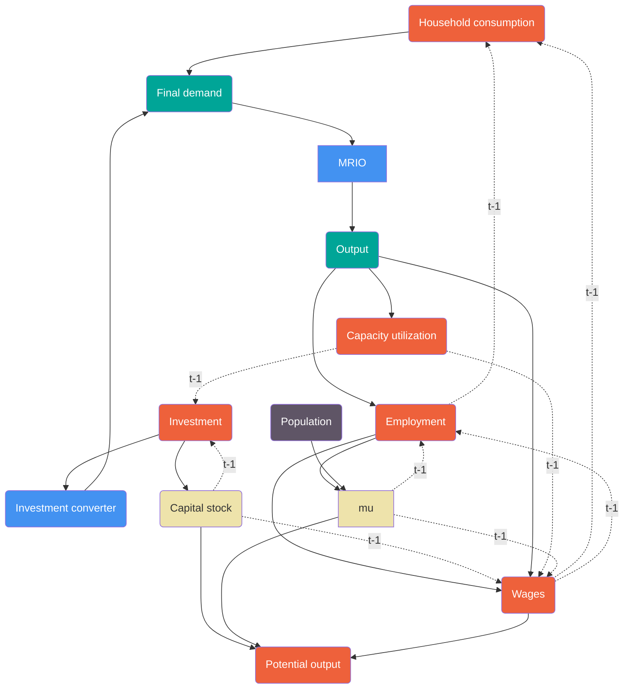

# Equations for dynamic solution

This set of equations is aimed to give a starting point / the simplest solution to endogenous growth dynamics in the model possible.



**Legend**
<span style="background-color:#4392F1"> &nbsp; </span>     Constant
<span style="background-color:#00A397"> &nbsp; </span>     Identity
<span style="background-color:#ED6844"> &nbsp; </span>     Equation
<span style="background-color:#EEE3AB"> &nbsp; </span>     Stock
<span style="background-color:#5F5566"> &nbsp; </span>     Exog
### Household consumption

```math

ln(C_{i, t}) = \alpha_{i} + \beta_{1} ln(W_{i, t-1}\times L_{i,t-1}) + \beta_{2} \Delta ln(W_{i, t-1}\times L_{i,t-1}) + \epsilon_{i} \\

```
where $C_{i,t}$ is aggregate household consumption in country $i$, for period $t$; the unit of $C$ is **kUSD**; $W_{i,t-t}$ is average wage in $t-1$ and $L_{i,t-1}$ is employment in $t-1$, note that $\Delta ln(W_{i,t-1} \times L_{i,t-1})$ is the difference from $t-2$ to $t-1$ or in words the change *for* the previous period; $\alpha$ is the country level fixed effect

| Variable              | Source | Classification | Disaggregation |
| --------------------- | ------ | -------------- | -------------- |
| Savings rate          |        |                | Country level  |
| Average industry wage |        |                |                |
| Employment            |        |                |                |

```math 
C_{i,t} = (1-\overline{\beta_{1,i}}) \times (W_{i,t-1}\times L_{i,t-1}) 
```

$\beta_{1,i}$ - constant take from WDI

| Variable     | Source  | Classification | Disaggregation |
| ------------ | ------- | -------------- | -------------- |
| Savings rate | WB WDI  |                |                |

### Investment

```math

ln(I_{i,t}) = \alpha_{i} + \beta_{1} \frac{Q_{t-1}}{Q^{\ast}_{t-1}} + \beta_{2} ln(K_{i,t-1}) + \epsilon_{i}

```

where $I_{i,t}$ is aggregate investment in country $i$, for period $t$; unit of $I$ is **kUSD**; $Q$ is aggregate output, while $Q^{\ast}$ is potential output, $K$ is accumulated capital

| Variable           | Source | Classification | Disaggregation |
| ------------------ | ------ | -------------- | -------------- |
| Investment         |        |                |                |
| Capital (stock)    |        |                |                |
| Output             |        |                |                |
| Output (potential) |        |                |                |
### Labour (employment)

For labour we actually estimate the ratio of labour force used compared to all available resources (i.e., total labour force accessible for the sector), this is done with the help of a probit model, hence

```math
\begin{align*}
& P(\lambda_{i,t}=1|ln(Q_{i,t}),ln(W_{i,t-1},),\mu_{i,t-1}) = \Phi(\alpha_{i} + \beta_{1}ln(Q_{i,t})+\beta_{2}ln(W_{i,t-1})+\beta_{3}\mu_{i,t-1} + \epsilon_{i}) \\
& \space \\ 
& \mu_{i,t-1} = \frac{1}{U_{i,t-1} / (U_{i,t-1} + L_{i,t-1})} \\
& \space \\
& \text{LF} = U_{i,t} + L_{i,t} \\
& \space \\
& L_{i,t} = \text{LF} \times \lambda_{i,t} \\ 
& \space \\
& U_{i,t} = \text{LF} \times (1 - \lambda_{i,t}) 
\end{align*}
```

where $\lambda_{i,t}$ is the employed share of available labour force (this can be sector specific), $Q$ is output, $W$ is average wage, $\mu$ is the inverse ratio of unemployment (or available workforce *for* the sector); *LF* is the all possible labour force, $alpha_{i}$ is the fixed effect for country $i$

| Variable      | Source | Classification | Disaggregation |
| ------------- | ------ | -------------- | -------------- |
| Output        |        |                |                |
| Average wages |        |                |                |
| Labour force  |        |                |                |

### Average wages


```math

ln(W_{i,t}) =  \alpha_{i} + \beta_{1}ln(K_{i,t-1}) + \beta_{2}ln(Q_{i,t}) + \beta_{3}\frac{Q_{t-1}}{Q^{\ast}_{t-1}} + \beta_{4}\mu_{i,t-1} + \epsilon_{i}


```

where $W_{i,t}$ is average wage (as in total wages divided by employment), $K$ is accumulated capital, $Q$ is output, $\frac{Q}{Q^{\ast}}$ is observed output divided by potential as shown earlier; $\mu$ is the inverse unemployment ratio

| Variable | Source | Classification | Disaggregation |
| -------- | ------ | -------------- | -------------- |
|          |        |                |                |
|          |        |                |                |
|          |        |                |                |

### Potential output

```math
\begin{align*}
& \text{estimation: } Q^{\ast} = \alpha_{i} + K_{i,t-1}^{\alpha} \times L_{i,t} \times W_{i,t}^{1-\alpha} \\
& \space \\
& \text{such as} \\
& K_{i,t} = K_{i,t-1} \times \frac{9}{10} + I_{i,t} \\
& \space \\
& \text{and} \\
& \space \\
& \text{forecast: } Q^{\ast} = \alpha_{i} + K_{i,t-1}^{\alpha} \times [L_{i,t} + U_{i,t}] \times W_{i,t}^{1-\alpha}
\end{align*}
```

where $Q^{\ast}$ is potential (maximum) output, given factors of production $K$ and $L \times W$, $L$ is employment as above, $W$ is average wage, while $K$ is capital stock; note that we assume that capital investment does not come online in the year when it is made, hence $K_{i,t-1}$ is used in $Q^{\ast}$; $\alpha$ is estimated on the first equation, but then we use the second equation for forecasting; importantly $U$ or the available workforce is added there, signalling that the short-term variable factor (labour) can be scaled up to adjust to higher demand with the same capital stock.