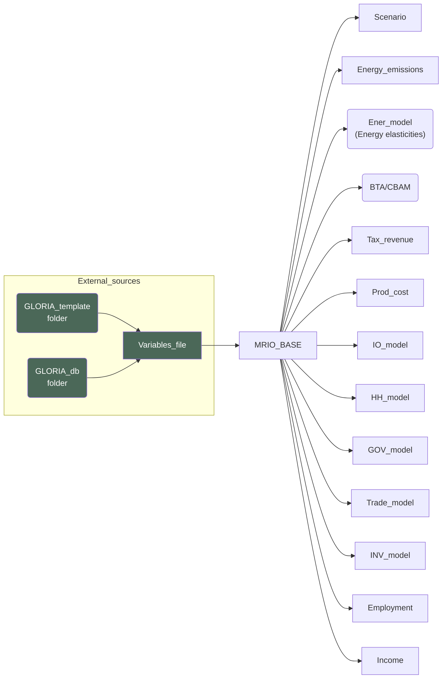

The exogenous inputs module handles collection of exogenous inputs. It is contained in the `SourceCode/exog_vars.py` script. 

_This class collects all the exogenous variables: elasticity parameters,
Input-Output and Final Demand information to be passed on to the modules,
loads the parsed GLORIA IO and final demand raw data.

## Files used
_____________________________________
Crucially, the module uses the `GLORIA_template\\Variables\\Variable_list_MINDSET.xlsx` file to retrieve variables (external data) from various sources contained within the `GLORIA_template\\` and `GLORIA_db\\` folders.

## Parameters
----------
IO_PATH : _str_, optional
	_root folder of MINDSET model_, by default current working directory
IO_FD_change : _type_, optional
	**_DEPRECATED_**, by default None
output_change : _type_, optional
	**_DEPRECATED_**, by default None

The scenario module is initialized by the following sequence:

```python
# INITIALIZE exogenous variables (excluding scenario variables)

MRIO_BASE = exog_vars()

```

The sequence reads in the exogenous vars into the MRIO_BASE object (*which is an exog_vars class object*).

## Flows
-------------------------------------

