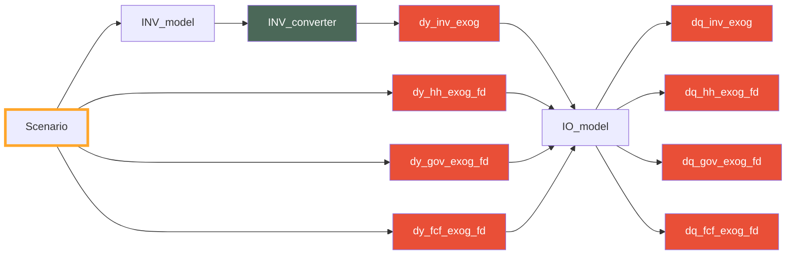

Part of the possible [[Impact channels]] of MINDSET.
### Description

Exogenous impacts are one of the main policy levers in MINDSET. Exogenous impacts (at the moment) can be investments or final demand changes. Exogenous impacts are collected and calculated through the `exog_vars.py` and `scenario.py`.

#### Exogenous investment (by sector!)
*Note: as the model does not currently have **investment by sector** baseline values, right now exogenous investment can only be specified with a dollar (absolute) value.*

Exogenous investment, by investing sector basically takes the values given to it in the scenario files and translates these into FCF final demand using the investment converter. The investment converter currently is *global* and located at `GLORIA_template\\Investment\\Inv_conversion.csv`
#### Exogenous final demand
Exogenous final demand is collected from the scenario files. If specified not in absolute terms, then the current (initial) y0 is used to calculate its value.

### Flows

## Notes

