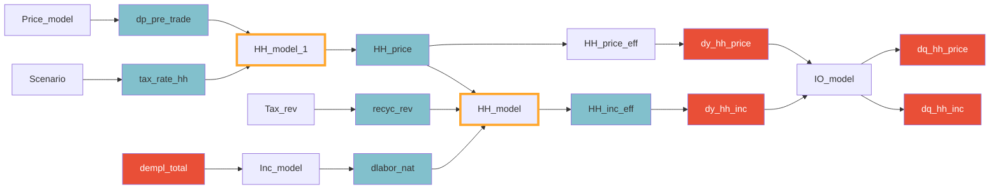

Part of the possible [[Impact channels]] of MINDSET.
### Description

Changes in household income are based on price effects, as well as recycled revenues and employment changes within the model iteration. Most of the effects are calculated in the [[Household module]]. 

The modeling takes three type of elasticities into account: own-price, cross-price and income elasticities. The elasticity parameters are stored as follows (this is specified in the `GLORIA_template\\Variable_list_MINDSET.xlsx`):

| Name           | Elasticity               | File                                            |
| -------------- | ------------------------ | ----------------------------------------------- |
| HH_INC_ELAS    | Income elasticities      | GLORIA_template\Elasticities\USDA_Table1.xlsx   |
| HH_OP_ELAS     | Own price elasticities   | GLORIA_template\Elasticities\USDA_Table2.xlsx   |
| HH_CP_ELAS_XXX | Cross price elasticities | GLORIA_template\Elasticities\USDA_cpe_xxxx.xlsx |
Due to these sources having lower sector / product resolution, the actual elasticity impact calculations are done with an aggregated sectoral structure (rather than the 120 sector structure). *This is expected to be changed*.

### Income change 
The calculations estimate the impact of income change simultaneously with the impact of price change for households. However, the income effect can be separated and calculated as:

```math
\beta_{i}^{\text{inc}}= (1 + \frac{\Delta \text{INC}}{\text{INC}}) ^ {\eta_{i}^{inc}}
```

where $\beta_{i}^{inc}$ is the demand incidence of the income change for product $i$, $\Delta\text{INC}$ is the change in in income, while $\eta_{i}^{inc}$ is the income elasticity for sector $i$.
### Price change
The price effect is then defined by:
```math
\beta_{i}^{op} = (1+\Delta p_{i})^{\eta_{i}^{op}}
```
where $\beta_{i}^{op}$ is the demand incidence of the price change, $\Delta p_i$ is the price change for the product / sector $i$, while $\eta_{i}^{op}$ is the own-price elasticity. 

Then cross-price elasticities are taken into account, such as:
```math
\beta^{cp}_{i} = \frac{\sum_{k=1}^{n}(1 + \Delta p_{k})^{\eta_{i}^{cp}}}{n}
```
## Results
The above shown equations generate `dy_hh_inc` and `dy_hh_price` which are demand effects based on the elasticities. The flows below show how these are used further on.
### Flows

Outside of the iteration, `dempl_total` is not part of the flow / calculation.


## Notes

