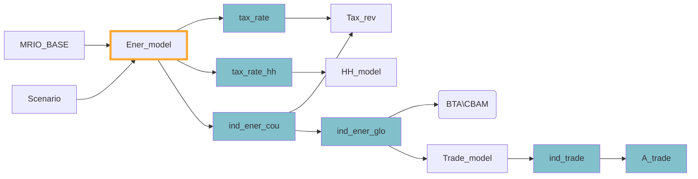

Part of the possible [[Impact channels]] of MINDSET.
### Description

In the case of technology, the substitution is limited to substitution across energy types (fuels) (these are GLORIA sectors `24,25,26,27,62,63,93,94`) based on cross-price elasticities and own-price elasticities (elasticities stored in `GLORIA_template\\Elasticities\\EnergyElasXXXX.xlsx` and the `GLORIA_template\\Elasticities\\OwnPrice.xlsx` files). Mostly handled in the `ener_elas.py` script.

The magnitude of technology substitution in these sectors is calculated based on own-price and cross-price elasticities of the technologies. Namely:

```math
\Delta\beta_{i,o} = (1 + \Delta p_{i})^{-\eta_{i,o}}
```
```math
\Delta\beta_{i,c} = \frac{\sum_{k=1,\space  k\ne i}^{n} (1 + \Delta p_{k})^{\eta_{i,k}}}{n-1}
```
```math
\Delta\beta_{i} = \Delta\beta_{i,o} \times \Delta\beta_{i,c}
```

where $\Delta \beta_{i,o}$ is the own-price elasticity induced volume change for sector $i$, $\Delta p_{i}$ is the price change for sector $i$, while $\eta_{i,o}$ is the own-price elasticity for sector $i$; in the next equation $\Delta \beta_{i,c}$ is the cross-price induced volume change for sector $i$, while $\eta_{i,k}$ is the cross-price elasticity between sectors $i$ and $k$; finally eq(3) gives us the overall effect of the magnitude, deriving $\Delta \beta_{i}$ (the overall effect for sector $i$) from the multiplication of the two effects.

*Note: Although in the code of the `ener_elas.py` script the text says **delta_tax** it also already includes price changes, due to these being added on line 204 of `RunMINDSET.py`, see notes for the actual code.*
### Flows


## Notes

The code shown here is located on line 204 of `RunMINDSET.py`:

```python
tax_rate, tax_rate_hh = Ener_model.assign_price_change(MRIO_BASE, Scenario.tax_rate, Scenario.tax_rate_hh, Scenario.cost_shock)
```
