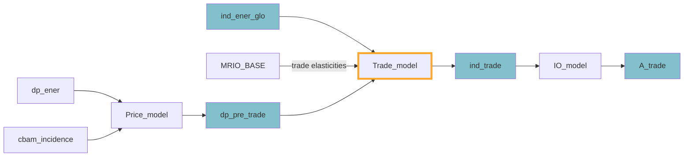

Part of the possible [[Impact channels]] of MINDSET.
### Description

Trade substitution is based on price differences between the trade partners (including domestic production). Trade elasticities are stored in the `GLORIA_template\\TradeElas_default.xlsx`. Most of the calculations are handled by the [[Trade module]], located in `trade.py`.

Trade substitution is allowed between existing trade partners; there is no cross-product trade substitution. The calculation is based on price differences (assume a single product for simplicity):

```math
\Delta p^{*}_{i} = \sum_{k=1}^n (\frac{\text{M}_{i,k}}{\sum{\text{M}_{i}}} \times (1+ \Delta p_{i,k})^{1-\frac{\eta}{2}}) 
```
where $\Delta P_i$ is the total price change seen in country $i$, $M_{i,k}$ is the volume of imported inputs from country $k$, so $\frac{M_{i,k}}{M_{i}}$ is the trade share for country $k$, $\Delta p_{i,k}$ is the price change observed for the flow of the product between country $i$ and $k$; and $\eta$ is the applied trade elasticity of the product; here we capture differences between the different prices, hence countries with higher price increases will lose more and vice versa.
This is followed by the calculation of the overall response to the aggregated price change:

```math
\Delta p_{i}^{*} = (\Delta p_{i}^{*})^{\frac{1}{1-\frac{\eta}{2}}}
\Delta p_{i}^{*} = (\Delta p_{i}^{*})^{\frac{1}{1-\frac{\eta}{2}}} 
```

So we've got an aggregated price from eq(1), but now we also want to see what is the aggregate response. This is what we get now in $\Delta p_{i}^{*}$, this will be the overall price effect for the *importing* country from price changes in existing trade partners.

We follow up by calculating (1) the **direct demand response to price change of the flow** ($\Delta P_i$) and (2) the **demand response to the overall price change of the good** ($\Delta P_{i}^{*})$

```math
\Delta P_{i,k} = (1+\Delta p_{i,k})^{1-\frac{\eta}{2}}
``` 
$\Delta P_{i}$ is the induced effect on the flow of the price change; this is calculated on the flow level
```math
\Delta P_{i}^{*} = (1 + \Delta p_{i}^{*}) ^ {\frac{\eta}{2}-1} 
```
$\Delta P_{i}^{*}$ is the induced effect of the total trade price change (i.e., overall demand response to price change across all trade partners), this leads to the overall effect being:
```math
\beta_{i,k} = \frac{M_{i,k}}{M_{i}} \times \Delta P_{i,k} \times \Delta P_{i}^{*} 
```

The overall trade effect $\beta_{i}$ is calculated such as eq(5), taking the existing trade shares and the price changes into account.
### Flows


