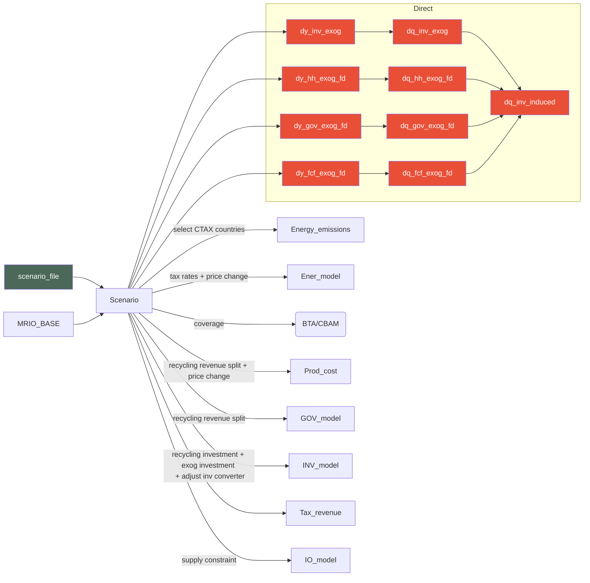

The scenario module handles collection of scenario inputs and calculations based on the inputs if necessary. It is based on the [[Exogenous inputs module]] and needs an *exog_vars* class object to function (usually *MRIO_BASE*).

The scenario module is initialized by the following sequence:

```python
if mrio_inverse_recalculate:
    if 'Y_BASE' in MRIO_BASE.__dict__.keys():
        del MRIO_BASE.Y_BASE
    if 'L_BASE' in MRIO_BASE.__dict__.keys():
        del MRIO_BASE.L_BASE
    if 'G_BASE' in MRIO_BASE.__dict__.keys():
        del MRIO_BASE.G_BASE
  
# Construct scenario module
Scenario = scenario(MRIO_BASE, Log)
```

Note: if `mrio_inverse_recalculate` is set to **True** we recalculate the main I-O based matrices (i.e., Ghoshian, Leontieff and Y - demand vector). This is needed if working with a country grouping. 

A policy scenario can include the following elements:
* Carbon tax
* CBAM
* Final demand
* Investment by
* Investment converter (adjustment)
* Supply constraints (adjustment)
* Price change
* Input-output coefficients (adjustment)
## Parameters
_____
### Attributes
EXOG_VARS : exog_vars
	exog_vars object containing exogenous variables
scenario_path : str
	path to the scenario file
Log : logging
	logging object used for writing logs

### Methods
set_carbon_tax
	Reads out carbon tax specification from the scenario file and constructs the necessary
	long-form matrix of tax incidences. Note: the function uses a parallelized approach
	and local storage (temporary storage) when construction the matrices due to the size
	of the necessary matrices.

carbon_tax_rate_loop(country:str)
	works together with `set_carbon_tax`, it is the internal parallel loop function for
	calculating carbon tax matrices in a parallel manner for each of the countries specified
	in the policy scenario

set_tax_rate(carbon_tax_incidence:pd.DataFrame)
	sets the actual tax rate based on the carbon tax incidence calculated from carbon taxes
## Flows
_____

