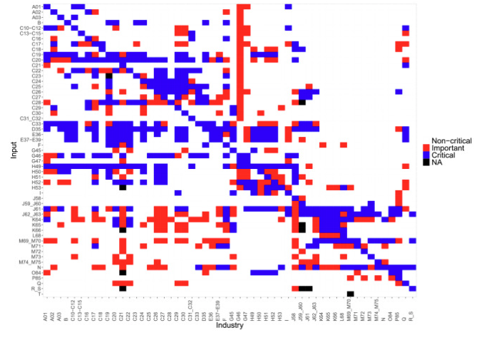
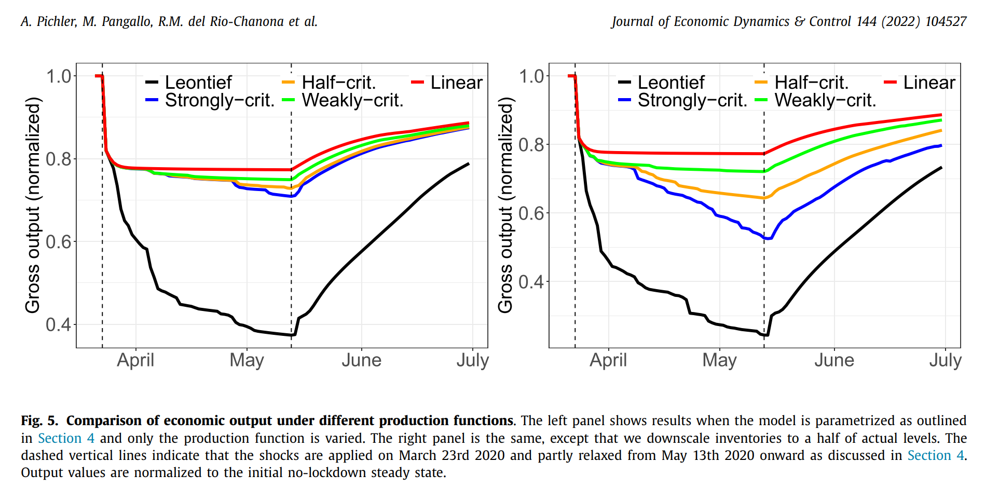
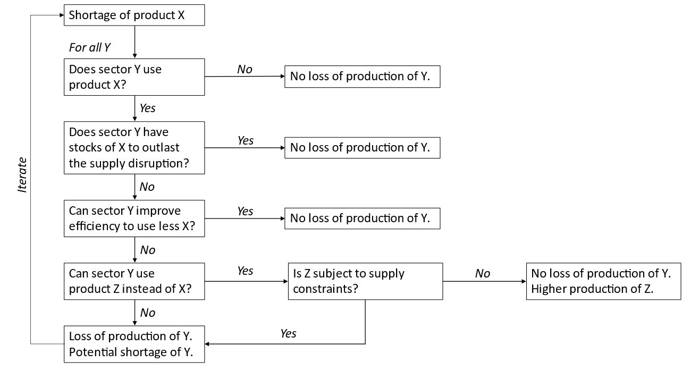

A supply constraint in the MRIO system can be modeled through a Ghoshian-shock, but this is a one-time shock, rather than a *real* restriction on production capacities. For a more sophisticated treatment a we can investigate methods adapted by (Hallegatte, 2008) or (Pichler _et al._, 2022). Here we present both the methods and critical features of the supply constraint method.
# Features
## **Criticality**
Pichler et al. (2022) define criticality of inputs based on a survey of IHS Markit analysts. They differentiate between (0) non-essential, (0.5) important but not essential and (1) essential inputs. The time-frame given for the question was 2 months (i.e., will it cause a substantial disruption if this input is not available for 2 months). The ratings assume that inventories are not present (i.e., zero).  

**Fig2** shows a reproduction of the criticality ratings matrix from the article. The authors note that most of the elements seem to be non-critical, while only 477 elements are said to be critical. However, it needs to be noted that many elements are anyway often zero in the IO matrix.

|                                                               |
| -------------------------------------------------------------------------------------------------------- |
| **Fig2**<br>[Pichler et al. (2022)](https://www.sciencedirect.com/science/article/pii/S0165188922002317) |

In a similar vein Henriet et al. (2012) argue the following: 
>*Results suggest that disaster-related output losses depend on direct losses heterogeneity and on the economic network structure. Two aggregate indexes – concentration and clustering – appear as important drivers of economic robustness, offering opportunities for robustness-enhancing strategies.*

Furthermore
> *It seems obvious, for instance, that a given amount of damages would have more serious consequences if concentrated in a key sector (e.g., electricity production and distribution) than if these damages are spread more homogeneously among sectors. [...]*
> *However, in these studies the economy is described as an ensemble of economic sectors which interact through an input–output table. [Hallegatte (2008)](https://www.sciencedirect.com/science/article/pii/S0165188911001825?casa_token=kfx3Ue7oJQ4AAAAA:mkPOm_S5bIEGQax_Maxy0xGrfiDc8YmU2Ka7eRgDr1efc2kPjQlu3fxDoQ2I9yDBFiFgzRlgGdt-#bib20) suggests such representation of the economy may be insufficient to model disaster consequences, especially when small businesses are involved. [...]*
> *These mechanisms are very difficult to represent at the sector scale and need a much more detailed analysis. [...]*
> *A crucial hypothesis is that **prices do not adapt rapidly after a disaster** and do not enable the necessary coordination among PUs to reach a first best production level, equivalent to an economic general equilibrium. [...]*
> *The heterogeneity of losses was found to play a central role in the indirect losses. When direct losses are more homogeneously distributed among PUs from one sector (e.g., lower right figure), total losses are drastically lower than when only one PU suffers all damages (upper left figure). More generally, for a fixed amount of direct damages, the total loss of the economy is decreasing with the number of affected PUs. [...]*

Diem et al. (2022) on the other hand highlight that due to complex structures, the actual damages might be hard to capture with sectoral level modelling (**Fig3**). Partially, because firms are **not** homogenous within the economy and partially, because firms input vectors differ tremendously.

|                                           |
| ------------------------------------------------------------------------------------ |
| **Fig3**<br>[Diem et al. (2022)](https://www.nature.com/articles/s41598-022-11522-z) |
>[!NOTE]
> While both Henriet et al. (2012) and Diem et al. (2022) argues for firm level or at least synthetic firm level analysis, the reality of that is likely to be minimal in our current context. Nevertheless, there are important takeaways from their work: 
> 
> First, **criticality** (as described in Pichler et al. (2022)) plays an important role, i.e. there are *more* and *less* important inputs, although it is hard to say what happens on the long-term if we lose less important inputs. 
> 
> Second, **concentration** of the impact matters as well, i.e. having an economy wide 1% impact with proportional impacts in all sectors is **NOT** the same as having an equal (volume) impact in a single sector. **For this reason, the resolution of the model matters a lot too.** Disabling a single sector, even if its overall economy share is low, might disable a crucial part of the economy too. Note that we are necessarily ignoring the spatial impact, and assume that within country inputs are substitutable. 
> 
> Finally, **clustering**: the crucial point here is that if the economy can be thought of as a set of loosely linked subcomponents (i.e., clusters working together with limited external inputs) then the dynamics of the impact can change - these are less likely to be exposed to national level impacts, but more likely to local ones. --> *Unfortunately, for clustering to be represented we would need to go below the national level in spatial terms.*

> [!IMPORTANT]
> Takeaways for MINDSET:
> 1. Adapt the Pichler et al. (2022) criticality approach
> 2. Highlight how the concentration and sectoral resolution matters based on Henriet et al. (2012), Diem et al. (2022) and Pollitt (forthcoming)

## **Trade and product substitution**

### Prioritization (export and final demand)

**Hallegatte (2008)** proposes that in case of an industry bottleneck rationing is expected behaviour. He describes the order such as: **domestic intermediate demand** **takes priority over domestic final demand, which takes priority over exports.**

>   *In case of bottleneck in the industry i, it is necessary to describe how its clients are rationed. In ARIO, the **rationing scheme is a mix of priority system and proportional rationing.*** *We assume that if an industry cannot satisfy demand, intermediate consumptions needed by other industries are served in priority. **<mark>It means that, in case of rationing, exports, final local demand, and reconstruction are the first demands not to be satisfied</mark>**. The priority given to intermediate consumption is justified by several facts. <mark>**Exports are rationed first because consumers outside the affected region can easily find other producers**</mark>. Final demand consists of household demand plus investments (except reconstruction). Investments can easily be delayed in case of disaster and can, therefore, be rationed with milder consequences. Household consumption is rationed before intermediate consumption because business-to-business relationships are most of the time deeper than business-to-household relationships and because a business would often favor business clients over household clients.* 

Nevertheless, during the COVID-19 crisis of 2020-2021 two other relevant behaviours were observed: (1) restricting exports (see [WTO](https://www.wto.org/english/tratop_e/covid19_e/trade_related_goods_measure_e.htm) data or [ITC](https://www.macmap.org/covid19) data), (2) allowing essential businesses to continue operations (see [Eurofound](https://www.eurofound.europa.eu/en/european-industrial-relations-dictionary/critical-occupations-essential-services) or [IMF](https://www.imf.org/en/Topics/imf-and-covid19/Policy-Responses-to-COVID-19)). The former points to the notion that without government intervention businesses might have been unwilling to restrict their exports; while the latter points to the fact that certain business are need to be kept running (and serving final demand) in order for a functioning society.
#### Restrictions on exports
In this light it needs to be noted that export restrictions were put in place in many countries for food and healthcare products (including pharmaceuticals), therefore while it is reasonable to continue the treatment of exports following Hallegatte (2008) it is **important to note that this does not happen due to economic / firm behaviour, but happens due to expected government regulatory action.** This is an important caveat to modeling.
#### Essential final demand
The other point however, that there are essential goods where final demand is prioritized will affect the modeling method too. For industries necessary for the functioning of economy we have to assume that final consumers are prioritized. When European gas prices were skyrocketing due to the Russian aggression households and small businesses were shielded from the price impacts by government policy ([see](https://www.energypolicy.columbia.edu/publications/anatomy-of-the-european-industrial-gas-demand-drop/)). As this case highlight, when it comes to essential consumption, final demand is often prioritized. The modeling should consider this too, by *prioritizing essential household and government consumption* over intermediate demand in *essential sectors*.

We can rely on a combination of US and EU defined list for essential occupations (both compiled in relation to COVID-19).

| EU list occupation<sup>[^1]</sup>       | US list occupation<sup>[^2]</sup>     | Consumer sector? | GLORIA sector           |
| --------------------------------------- | ------------------------------------- | ---------------- | ----------------------- |
| Food manufacturing and production       | Agricultural workers, food processing | Yes              | 1-19, 22-23, 41-54      |
| Transport workers                       | Postal services / Transportation      | Yes              | 101-107                 |
| Public institutions, emergency services | Public health and safety              | Yes              | 116                     |
| Pharmaceuticals and healthcare goods    | Public health and safety              | Yes              | 69                      |
| Healthcare workers                      | Public health and safety              | Yes              | 118                     |
| Child and social care workers           |                                       | Yes              | 118                     |
|                                         | Cashiers (retail)                     |                  |                         |
|                                         | Electricians, plant operators         |                  |                         |
| *Energy (incl. petrol)*                 | *Energy (incl. petrol)*               | Yes              | 24-27, 63, 93-94, 95-96 |

>[!IMPORTANT]
>Takeaways for MINDSET:
>1. Adapt Hallegatte (2008): priority system and proportional rationing, i.e., domestic intermediate demand comes first, taking priority over final demand (\*see (3) below) and over exports; remaining products are proportionally rationed in all cases; 
>2. Note: this means: (1) criticality applies first; (2) then proportional rationing to non-critical intermediates *and* domestic final demand, (3) remaining products are proportionally rationed to exports 
>3. Final demand of households and government takes precedence in *essential industries*, as in industries specified [essential final demand](#essential-final-demand), here **final demand of households and government is supplied first**, before any other intermediary demand

### Imports and input substitution

While the above stated prioritization can provide a solution for reducing the output gap, by decreasing exports and final demand another relevant solution is increasing imports and substituting inputs to other inputs.

From Henriet et al. (2012): 
>  For instance, when a supplier is not able to produce enough, the production of its client does not automatically decrease, **because it can adapt and maintain production**: (i) it may be possible for clients **to import [intermediate goods](https://www.sciencedirect.com/topics/economics-econometrics-and-finance/intermediate-good "Learn more about intermediate goods from ScienceDirect's AI-generated Topic Pages") from outside the damaged area**; or (ii) clients may find an **alternative local producer who is able to produce more than its usual production and replace the failing one**; or (iii) clients may have enough stock to wait for its suppliers to restore their activity. [...]

From this, importing is a relevant suggestion. Finding an alternative local producer is also important, but due to the national scale of IO tables (in the case of MINDSET) **it is implicitly already assumed**.

From Pollitt (forthcoming):
> The **import switching** and efficiency gains are entered to the model as proportions that reduce the scale of the impact of a shortage. For example, if the food industry could replace 40% of its agricultural inputs **with imported agricultural produce**, the required reduction in production from a complete loss of domestic agricultural inputs is 60%. For **domestic input substitution, the model attempts to replace input of a single good with inputs from a basket of all other goods**. However, these other goods cannot be subject to supply restrictions themselves. The amount of production that is saved is proportional to the share of available alternative inputs that are not restricted. **If substitution to another sector is possible, an increase in demand for the production in that sector is recorded**.

From Pollitt's text the potential to replace inputs with other goods is also an important possibility, however, it needs to be noted that this might be a timely / costly process.

> [!CAUTION]
> Note that when we're talking about input substitution the availability of production for substitution is also a crucial question. Others sectors can only increase their production up until to the point of their potential production. Note, that **prioritization is another unclear point, where *prices* necessarily come into question**. I.e., if a certain resources is critical (as a substitute for a industry, than that industry might be willing to pay higher prices for that good, leading to extraordinary price effects). <mark>*The question whether to increase price for the substitute or shut down production is a crucial one.*</mark>  

Therefore, when thinking about substitution of inputs we want to consider three separate cases:
1. Input substitution towards imports within same industry; i.e., replacing $`X_d`$ product that was sourced domestically (hence the $`d`$ index) so far with $`X_{imp}`$ 
2. Input substitution towards domestic production of a different industry; i.e., replacing $`X_d`$ product with $`Y_d`$ product
3. Input substitution towards imports of a different industry; i.e., replacing $`X_d`$ product with $`Y_{imp}`$ product ***-- while this is theoretically still a case to simplify our approach we will not include this case in the modeling*** 

There are several pre-requisites and assumptions that we need to make to be able to capture these mechanisms though. We are going to introduce these by going through the different cases. **Note that due to the [criticality](#criticality)** feature that we introduced earlier these only apply to **important and critical inputs**. 
#### Input substitution same industry, import
First, we need to assume that this is only possible for goods with already established trade; this is to avoid estimating trade that is not possible for various uncaptured reasons (geographics, politics, etc.). 

Second, to be somewhat conservative on the potential for substitution we can assume that the maximum ratio of import is the historically observed maximum. I.e., if the automotive industry in Belgium used to import 20% of its steel from Finland then even if it runs into a supply shock the maximum that it can import can be no more than 20%. Consequently, if the import ratio is the highest in the current year we assume that it cannot be extended further.

Third, we assume that there is a price premium $`\mu_1`$ that the firms are willing to pay for these products, if the price is higher than this, then they rather shut down production. While we think that this number is somewhat arbitrary and based on human judgement, the average profit margin is a good (although probably *lower bound*) approximation.
#### Input substitution different industry, domestic
In this case the industry chooses to replace a **critical or important** input with an input from another industry. This is a possibility when certain inputs that are not covered under the same sector are interchangeable. For this we first need to determine which of these inputs are potentially interchangeable, this is detailed in the [[Estimating input substitution possibilities]] note. There are important assumptions here as well:

First, the new sectoral input vector is based on a linear combination of observed input vectors for that particular sector across the world over time.

Second, substitution induced demand (reiterating the above part) can take precedence over exports.

Third, it is too subject to price competition. There is a $`\mu_2`$ price premium that firms are willing to pay.

#### Price competition of inputs and the most-likely bundle
Inputs are then subject to price competition; however contrasting a CGE approach only if they face a supply constraint. The philosophy behind this is that it is very likely that firms need extreme conditions (a *shock*) to change the production recipes / suppliers, as it entails costs, uncertainty and risk. The same goes for switching from domestic to international suppliers - if it is even possible.

Therefore, if $`q_{[i,a],[j,a]}^{missing}`$ is the volume of $`j`$ inputs missing in $`i`$ industry both located in country $`a`$ due to supply constraints of $`q_{[j,a]}`$, then:
1. we test whether there is any $`q_{[j,b]}`$ is available, and if yes then whether $`p_{[j,b]} \le \mu_{io} * p_{[j,a]}`$, i.e. whether the price price of the imported good is acceptable for the producer; if on both conditions yes, then $`\hat{q}_{[i,a],[j,a]}^{missing} = q_{[i,a],[j,a]}^{missing} - \hat{q}_{j,b}`$, where $`\hat{q}_{[j,b]}`$ is the amount purchased from the import source
2. if $`\hat{q}_{[i,a],[j,a]}^{missing} > 0`$ after the first step, then we want to test whether another possible production receipt would be serviceable from the potential inputs; first we need to calculate the **strong criticality** incidence on output of $`i`$ sector if the input is still missing, let's call this $`q^{missing}_{i}`$ . 
3. Let's have $`A`$ as an input matrix, where $`a_{i,j}`$ is the input coefficient (following the Leontief calculations); then let's have $`v^{0}_{i}=A_{.,i}`$, which is the input vector for the $`i`$ sector; but as we have data from other years and other countries we actually have $`v^{0}_{i}, v^{1}_{i}, v^{2}_{i}, ..., v^{n}_{i}`$, which are all feasible input configurations for sector $`i`$; 
4. Therefore, we can calculate a new possible input vector such as: 
```math
 \hat{v}_{i} = \begin{bmatrix}
	   \beta_{1} v^{0}_{i} + \beta_{2} v^{1}_{i} + ... + \beta_{n} v^{n}_{i} 
	\end{bmatrix}
```

5. Which in turn is constrained by output availability in those new sectors, therefore, what we're searching for is $`\hat{v}_{i}`$ in the below:

```math
q^{missing}_{i} \times \hat{v}_{i} \le q^{*}
```
where $`q^{*}`$ is the current output potential from supplying sectors; alternatively we can write it as:
```math
 min(q^{*} - q^{missing}_{i}\times \hat{v}_{i}) 
```
We're optimizing for $`\beta_1`$ to $`\beta_n`$ . 

Quite importantly, the new input vector will only apply to that part of the production that otherwise would be constrained by the supply constraint shock. The input vector that we carry over to the next (and subsequent years) is a weighted average of the original and the adjusted vector.

## **Efficiency gains**

Efficiency gains are mentioned by Pollitt (forthcoming); however, we posit that efficiency gains are mainly observed if (and when) non-critical inputs can be eliminated. Therefore, efficiency gains are most likely (in the context of supply constraints) to be coincide with [criticality](#criticality).

>[!IMPORTANT]
   Takeaways for MINDSET: 
 >1. Therefore, further efficiency gains - related to supply constraints - are **not** considered in MINDSET.

## **Inventories**

Pollitt (forthcoming) and Pichler et al. (2022) both discusses the impact of inventories as buffer. Pichler et al. incorporates inventory levels in their modelling, but for them the temporal frame of the model (daily steps) makes this possible in a *reasonable* manner.

It needs to be noted though, that inventory holding is not relevant for various sectors (e.g., utilities) and due to the heterogenous firm level practices (while there are definitely sectoral patterns too) it is rather hard and data intensive to model it properly.

> [!IMPORTANT]
> Takeaways for MINDSET:
> 1. While the role of inventories is definitely crucial in firm resilience modeling it is rather complicated and inventories themselves can serve various purposes and have many forms (e.g., input inventories - which are obviously not interchangeable, final product inventories, etc). Inventory holding might provide resilience to supply-chain disruptions its role is not necessarily major when it comes to the effects of climate related events.
> 2. Therefore, **we do not represent inventories** in MINDSET.
# Ghoshian-inverse and shock

At the time of writing (7/6/2024) MINDSET models supply constraints through a Ghoshian (supply-side) shock to the the economy. 

In their seminal book Miller and Blair (2009) describes "supply-side" or Ghoshian models in Chapter 12, pp543-554. 

> *In 1958 Ghosh presented an alternative input-output model based on the same set of base-year data that underpin the demand-driven model* \[the widely known Leontief-model - BKD\] \[...\]
> *In the demand-driven model, direct input coefficients are defined in $`A = Z\hat{x}^{-1}`$ leading to $`x = (I-A)^{-1}f=Lf`$ . In this case the Leontief inverse relates sectoral gross outputs to the amount of final product (final demand) - that is, to a unit of production **leaving*** *the interindustry system at the end of the process.* *The alternative interpretation* \[which is the basis of the Ghoshian approach - BKD\] *that Ghosh suggests relates sectoral gross production to the primary inputs - that is, to a unit of value **entering** the interindustry system at the beginning of the process.
> This approach is made operational by essentially "rotating" or transposing our vertical (column) view of the model to horizontal (row) one. Instead of dividing each column of **Z** by the gross output of the sector associated with that column, the suggestion is to divide each row of **Z** by the gross output of the sector associated with that row.*\[...\]

This will yield a $`B`$ matrix, which is a matrix of where the origin industries' inputs are used, rather then the Leontief-inverse's $`A`$ matrix which shows where inputs for the industries' production are coming from.

Following from Miller and Blair:
> *Define*
> $`G = (I - B)^{-1}`$
> *with elements $`g_{ij}`$. This has been called the **output inverse**, in contrast to the usual Leontief inverse, $`L = [l_{ij}]=(I-A)^{-1}`$ (the **input inverse**). Element $`g_{ij}`$ has been interpreted as measuring the "total value of production that comes about in sector $`j`$ per unit of primary input in sector $`i`$.* \[...\]
> *The basic assumption of the supply-side approach is that the output distributions in $`b_{ij}`$ are stable in an economic system, meaning that* <mark>if output of sector $`i`$ is, say, doubled, then the sales from $`i`$ to each of the sectors that purchase from $`i`$ will also be doubled. Instead of fixed input coefficients, fixed output coefficients are assumed</mark> *in the supply-side model.*

This type of modeling approach, while initially has been intended by Ghosh to capture *normal* economic behaviour, has been interpreted as something that can be used for understanding **disruptions**. From Miller and Blair (2009, p549), who cite Giarratani (1981):
> *\[...\] this behavior may be the result of voluntary supply decisions in the same context or, alternatively, **given the disruption of some basic commodity*** \[highlight added\]

>[!NOTE]
>**The *joint stability* problem**: Miller and Blair (2009) point out the joint stability problem; i.e. that the Leontief-inverse based calculation assumes that $`A`$ remains constant, while the Ghoshian-inverse assumes that $`B`$ remains constant. As they point out both cannot be true at the same time, as applying changes to the Ghoshian-inverse would inadvertently result in a new $`A`$ matrix and *vice versa*.

>[!IMPORTANT]
>Takeaways for MINDSET:
>1. In the current MINDSET implementation, we model supply constraints as a fully fledged (i.e., all inputs are **critical** type) Ghoshian-type shock. 
>2. The $`B`$ matrix, that is used for calculating the $`G`$ (output or Ghoshian-inverse) is calculated on the base data. The **joint stability problem** is not present, because both the $`A`$ and $`B`$ matrices are calculated on base data and are **not** recalculated during the modelling.
>3. The proposed MINDSET implementation should still use the $`G`$ inverse as a basis for calculating supply-shock effects, but complemented with the below additions (Hallegatte, Pichler et al., Pollitt) and should consider how the joint stability problem will effect the overall solution.
# Hallegatte ARIO supply constraint

**Hallegatte (2008) presents an ARIO model, with supply constraints, we reproduce most of the A.1 Annex here, which describes the model:**

From there, we can calculate, with a one-month time step, the production and consumption of each industry. To do so, we start from the total final demand and we follow a series of steps.

**Step 1.** For each industry, we calculate a first-guess production, by solving [Equation (A.1)](https://onlinelibrary.wiley.com/doi/full/10.1111/j.1539-6924.2008.01046.x#m3):
```math
Y^0 = (1-A)^{-1}TFD 
```
These productions are those classically evaluated in an IO framework, which does not consider production capacities. But, in our modeling framework, we also want to take into account production capacities and production bottlenecks. To do so, we consider these productions without production constraints, $`Y^0(i)`$ , as first-guess _Total Demands_ $`TD^0(i)=Y^0(i)`$, which include demands from other industries. Then, we assess the ability of each industry to satisfy these demands.

Each industry can be unable to produce enough (a) because its own production capacity is insufficient or (b) because other industries are unable to provide the necessary amount of inputs in the production process.

**Step 2.** Production capacities are first taken into account: for each industry $`i`$, production is the minimum of the first-guess production and the _production capacity_ $`Y^{max}(i)`$:

```math
Y^1(i) = MIN(Y^{max}(i);TD^0(i))
```

**Step 3.** Then, we consider intermediate consumptions and the possible rationing of industries. \[...\] Here, the _rationing scheme_ is a mix of priority system and proportional rationing (see [Trade substitution](#trade-and-product-substitution)). \[...\]

To calculate bottlenecks, we loop over all commodities and, for each commodity $`i`$, we define $`O^1(i)=\sum_jA(i,j)Y^1(j)`$ as the first-guess amount of orders that the industry $`i`$ is asked to satisfy by other industries. We then consider two cases.

1. If $`Y^1(i)\ge O^1(i)`$ then the industry $`i`$ is able to provide enough commodity to all other industries and the production of these other industries is not affected.
2. If $`Y^1(i)\lt O^1(i)`$, then the industry $`i`$ is not able to provide enough commodity to all industries and each industry $`j`$ sees its production limited by the availability of commodity $`i`$. In that case, the production of the industry $`j`$ is bounded by: 

```math
\frac{Y^1(i)}{O^1(i)}Y^1(j)
```

This process, for all commodities (we assume that imports are never constrained), leads to the new amount of production by each industry $`i`$:
```math
Y^2 = MIN \{ Y^1(i); \text{for all } j, \frac{Y^1(j)}{O^1(j)}Y^1(i) \}
```

After having swept all industries, we obtain a new set of productions $`\{Y^2(i)\}`$. If $`Y^2=Y^1`$, i.e., if there is no bottleneck, then $`Y^2`$ is the actual production. Otherwise, these new productions $`Y^2`$ are inconsistent with each other <mark>because they do not take into account that an industry that produces less also demands less from its suppliers</mark>. To take this backward influence into account, we compute a new Total Demand $`TD_1(i)`$:

```math
TD^1(i) = TFD(i) + \sum_i A (i,j)Y^2(j)
```

And we repeat Steps 2 and 3, with $`\{TD^1(i)\}`$ instead of $`\{TD^0(i)\}`$ . Since all industries are interconnected, indeed, we need to iterate the bottleneck calculation until convergence of the vector $`Y^k`$. \[...\]

> [!IMPORTANT]
> Takeaways for MINDSET:
> 1. If we adapt this method for MINDSET, it introduces a new convergence criteria; but settles the issue of *real* supply constraints
> 2. We ideally mix this approach with criticality from Pichler
# Pichler
Developed during COVID, building on Hallegatte (2008).

> *A key innovation in our economic model is the introduction of an industry-specific production function with a new concept of substitution between intermediate inputs* \[...\]
> *To solve this problem we introduce a new production function **that distinguishes between critical and non-critical inputs** at the level of the 55 industries* \[...\]
> *The **Partially Binding Leontief (PBL)** production function that we introduce here allows firms to keep producing as long as they have the inputs that are absolutely necessary, which we call critical inputs \[...\]*
> *Another key element of our modeling approach is a **detailed representation of industry-specific input inventories.** Inventories act as buffers in the presence of supply chain disruptions or demand shocks and thus can play an important role in shock propagation dynamics.*

They consider multiple functional forms for the production function, starting with the most restrictive Leontief production function and having other versions dependent on the understanding of what an *important* (but not critical) inputs is. The *half-critical* formulation (where important is understood as 0.5 limitation) and the *strongly-critical* formulation (where important is understood same as critical) are the most relevant ones for us. 

Strongly critical:

```math  
x^{inp}_{i,t}= \underset{ j\epsilon \{V_i \cup U_i \}} {min} \{\frac{S_{ji,t}}{A_{ji}}\}
```
Half critical is:
```math
x^{inp}_{i,t}= \underset{ \{j\epsilon V_i,  k \epsilon  U_i \}} {min} \{\frac{S_{ji,t}}{A_{ji}}, \frac{1}{2} (\frac{S_{ki,t}}{A_{ki}}+x^{cap}_{i,0})\}
```
$`V_i`$ critical, $`U_i`$ important inputs
> *interpret the important input to mean that its absence constrains production by a factor of 0.5 relative to a critical input*

In this article Pichler et al. assumes proportional rationining. 

|                                      |
| ------------------------------------------------------------------------- |
| **Fig1 [Pichler et al 2022](https://doi.org/10.1016/j.jedc.2022.104527)** |

> [!IMPORTANT]
> Takeaways for MINDSET:
> 1. Adapt Pichler et al. half critical method in tandem with Hallegatte constrained supply method

# Pollitt

Hector Pollitt's work is upcoming on this, but falls in the space after Hallegatte and Pichler. Hector summarizes the above described effects, with the below graph:

|  |
| ------------------------------------------- |
| **Fig2** [[Pollitt (forthcoming)]]          |

Following along the figure:
1. Sector use of is the IO table itself
2. **This is inventory keeping**
3. **Efficiency improvement**
4. **Substitution across products**

Note that Hallegatte and Pichler does not cover these fully; i.e. Hallegatte covers (1), while Pichler et al. covers (1-2); however, they do not cover (3-4), although it needs to be noted that this is also a result of the timeframe that they are interested in - their argument is that in a long-term case (which is needed for 3-4) a CGE type modeling, which allows for substitution might capture the effects better. 

Pollitt also notes that
> *it may not be possible to replace domestic production with imports at short notice* \[...\]
> *It is possible for a single sector to suffer simultaneously from a shortage of production capacity and a shortage of demand. In such a situation, the sector would produce even less than its reduced capacity because frictions make it difficult to divert sales to different sectors.*

> [!IMPORTANT]
> Takeaways for MINDSET:
> 1. Think about substitution across products in the MINDSET method. See [import and input substitution](#imports-and-input-substitution)

# MINDSET implementation

## Current implementation

The current implementation is based on the [Ghoshian inverse](#ghoshian-inverse-and-shock) approach, but further takes [criticality](#criticality) of linkages between sectors into account.

Therefore, it involves creating a Ghoshian type shock, but with an $`B`$ matrix, where inputs from non-critical industries are reduced to zero and inputs from *important* industries are reduced by $`\frac{1}{2}`$.
## Proposed implementation

Based on all the above, the MINDSET implementation aims to take criticality, prioritization and proportionality into account. While input substitution is an important factor, we expect it to be only added later into the actual implementation.

Therefore, out current implementation is mostly based on the process described in Hallegatte (2008) and Pollit (forthcoming), while also encompasses the criticality aspect described in Pichler et al. (2022) and takes essential final demand account. Input substitution is *currently* not implemented.


# Literature

Diem, C., Borsos, A., Reisch, T., Kertész, J. and Thurner, S. (2022), “Quantifying firm-level economic systemic risk from nation-wide supply networks”, _Scientific Reports_, Nature Publishing Group, Vol. 12 No. 1, p. 7719, doi: [10.1038/s41598-022-11522-z](https://doi.org/10.1038/s41598-022-11522-z).

Hallegatte, S. (2008), “An Adaptive Regional Input-Output Model and its Application to the Assessment of the Economic Cost of Katrina”, _Risk Analysis_, Vol. 28 No. 3, pp. 779–799, doi: [10.1111/j.1539-6924.2008.01046.x](https://doi.org/10.1111/j.1539-6924.2008.01046.x).

Henriet, F., Hallegatte, S. and Tabourier, L. (2012), “Firm-network characteristics and economic robustness to natural disasters”, _Journal of Economic Dynamics and Control_, Vol. 36 No. 1, pp. 150–167, doi: [10.1016/j.jedc.2011.10.001](https://doi.org/10.1016/j.jedc.2011.10.001).

Miller, R.E. and Blair, P.D. (2009), _Input-Output Analysis: Foundations and Extensions_, 2nd edition., Cambridge University Press, Cambridge England ; New York.

Pichler, A., Pangallo, M., del Rio-Chanona, R.M., Lafond, F. and Farmer, J.D. (2022), “Forecasting the propagation of pandemic shocks with a dynamic input-output model”, _Journal of Economic Dynamics and Control_, Vol. 144, p. 104527, doi: [10.1016/j.jedc.2022.104527](https://doi.org/10.1016/j.jedc.2022.104527).

# Footnotes

[^1]: Source: https://www.eurofound.europa.eu/en/european-industrial-relations-dictionary/critical-occupations-essential-services
[^2]: Source: https://www.bls.gov/careeroutlook/2020/article/essential-work.htm