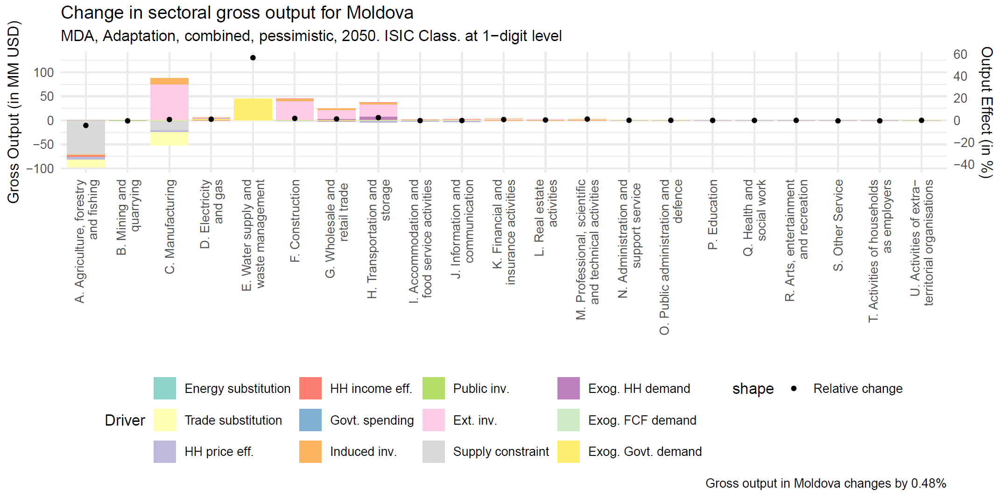

The R charts tool is located in the root folder of MINDSET and called `Results_plot_vXXXX.R`. It is an R file that prints out the 'standard results charts', which are employment/output/GVA per country per scenario per impact channel.

These charts look like the one shown below:



# Running
The chart tool can be run in two ways: (1) directly from the command line, (2) manually from RStudio (or R). 

## From the command line
To run from the command line you need to know where you're R executable is located, although it is mostly in program files. Open command line from the root of your MINDSET folder, then type:

```
"C:\Program Files\R\R-4.3.0\bin\RScript.exe" "Results_plot_v0.1.1.R" "Yes"
```

Replace v0.1.1 with the current version number if necessary. Specifying the `"Yes"` at the end of the command tells R that you're already in your MINDSET folder (you'll see that in the RStudio version this needs to be specified by hand). Crucially, running the tool this way can be the last step in a batch file first running the model, then printing out the results.
### Advanced options
You can also use two further options in the command line code, these are the fourth and fifth arguments. First, you can specify **if you want to print only for select countries**, second you can specify which **scenario files to process**.

```
"C:\Program Files\R\R-4.3.0\bin\RScript.exe" "Results_plot_v0.1.1.R" "Yes" "MDA,ROU" "FullResults_.*.xlsx"
```

So, for example the below line, will only produce charts for Moldova (MDA) and Romania (ROU), even if there are other countries in the results files too. Also, it will only process scenario files that match to the pattern `FullResults_.*.xlsx`.

Alternatively, one might want to get all countries, but focus on some scenarios, in this case:
```
"C:\Program Files\R\R-4.3.0\bin\RScript.exe" "Results_plot_v0.1.1.R" "Yes" "ALL" "FullResults_MDA_Climate_.*.xlsx"
```

This command will only print results for scenario files that match the `FullResults_MDA_CLimate_.*.xlsx` pattern (where `.*` means any number of any character), but will print `ALL` countries that are available.

## From R/RStudio
If you're running from R (or RStudio, but I'll keep just mentioning R) directly, you first need to specify your MINDSET folder. This you can do by assigning the path to your directory to the `MINDSET_FOLDER` variable. 

```r
# if running from RStudio you need to set by hand!
MINDSET_FOLDER = 'C:/Users/wb619071/OneDrive - WBG/Documents/MINDSET/MINDSET/MINDSET_module'
# activated if first argument is set
MINDSET_FOLDER = if(length(args) > 0) getwd() else MINDSET_FOLDER

# if want to print only select countries, specify them here
SELECT_COUNTRY = c()
SELECT_COUNTRY = if(length(args)>1) str_split(args[2],",")[[1]] else SELECT_COUNTRY
SELECT_COUNTRY = if(SELECT_COUNTRY[1]=='ALL') c()

# if you want to specify which scenarios to print specify here as regex pattern
PATTERN = "FullResults_.*.xlsx"
PATTERN = if(length(args)>2) args[3] else PATTERN
```

Here you also have the option to set the same things without specifying arguments as above, but here you can specify those through adjusting the variables `SELECT_COUNTRY` and `PATTERN`. Note that by default `SELECT_COUNTRY = c()` means that all countries will be printed, while `PATTERN = "FullResults_.*.xlsx"` processes all scenario files that start with the words `FullResults`.

Here you can also adjust names of the impact channels and sector names; these are stored respectively in the `rename_variables` and `isic_names` vectors.

```r
rename_variables_ <- c(
  'tech_eff' = 'Energy substitution',
  'trade_eff' = 'Trade substitution',
  'hh_price' = 'HH price eff.',
  'hh_inc' = 'HH income eff.',
  'gov_recyc' = 'Govt. spending',
  'inv_induced' = 'Induced inv.',
  'inv_recyc' = 'Public inv.',
  'inv_exog' = 'Ext. inv.',
  'supply_constraint' = 'Supply constraint',
  'hh_exog_fd' = 'Exog. HH demand',
  'fcf_exog_fd' = 'Exog. FCF demand',
  'gov_exog_fd' = 'Exog. Govt. demand'
)

isic_names <- c("A. Agriculture, forestry\n and fishing", "B. Mining and\n quarrying", "C. Manufacturing",
        "D. Electricity\n and gas", "E. Water supply and\n waste management", "F. Construction",
        "G. Wholesale and\n retail trade ", "H. Transportation and\n storage",
        "I. Accommodation and\n food service activities", "J. Information and\n communication",
        "K. Financial and\n insurance activities", "L. Real estate\n activities",
        "M. Professional, scientific\n and technical activities",
        "N. Administration and\n support service ", "O. Public administration and\n defence",
        "P. Education", "Q. Health and\n social work", "R. Arts, entertainment\n and recreation",
        "S. Other Service", "T. Activities of households\n as employers",
        "U. Activities of extra-\nterritorial organisations")
```
